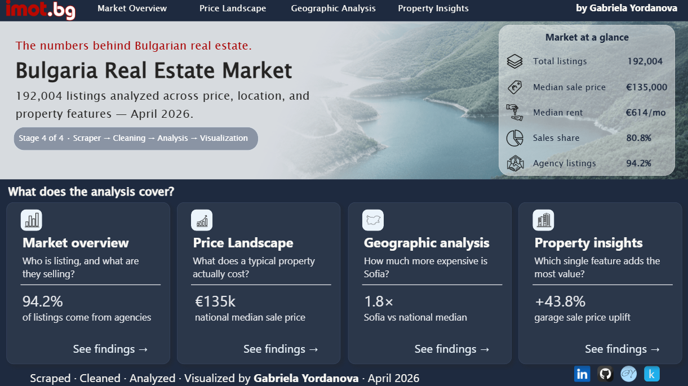
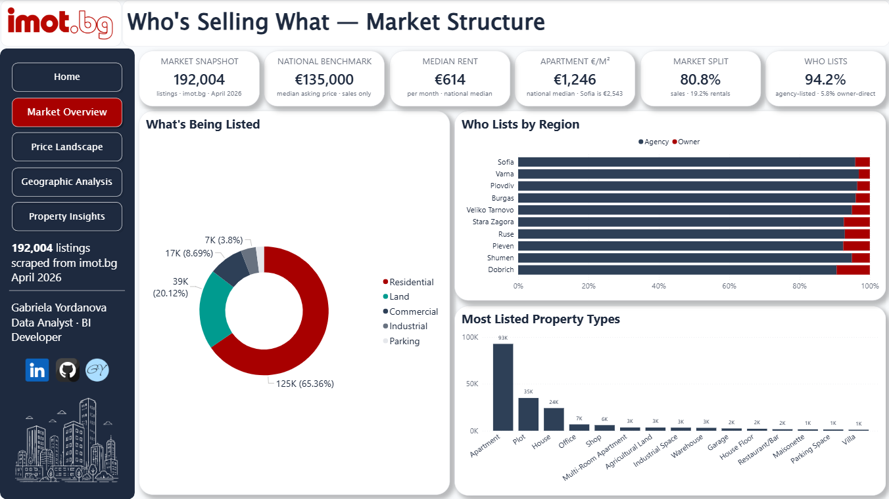
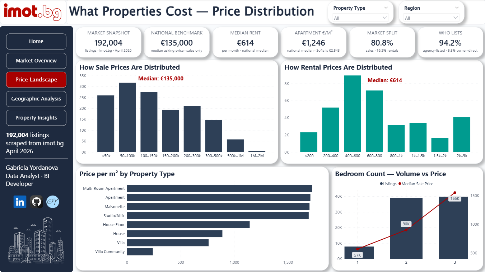
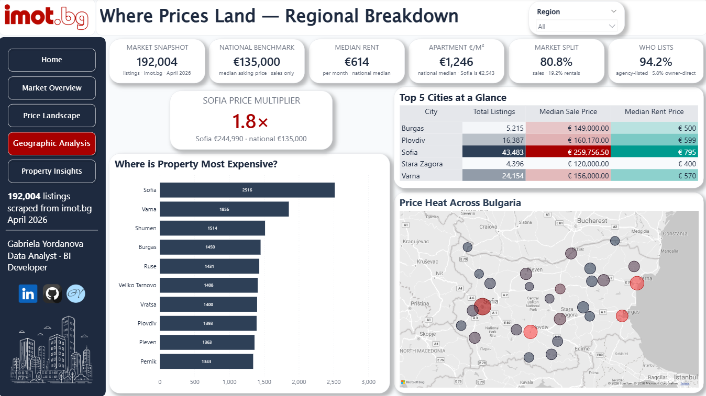
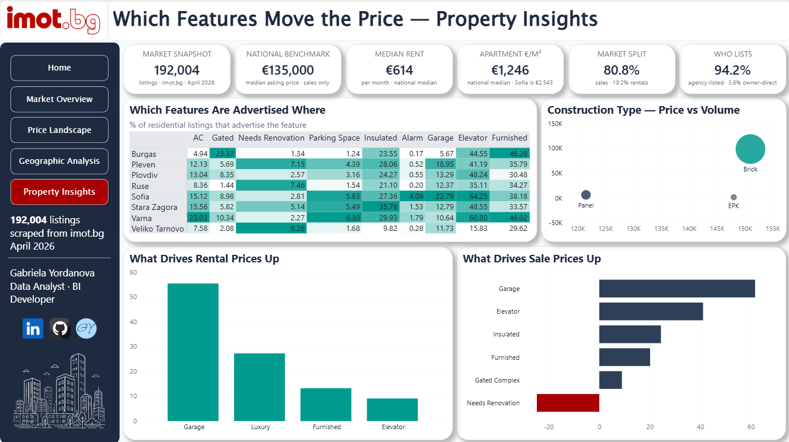

# 📊 Bulgaria Real Estate Visualization

## 🏷️ Project Badges

[](https://powerbi.microsoft.com/)
[](https://www.kaggle.com/datasets/gabrielagencheva/bulgaria-real-estate-listings)
[](LICENSE.txt)

## 📖 Overview

An interactive Power BI dashboard visualising the Bulgarian residential and commercial property market, based on **192,004 deduplicated listings** scraped from [imot.bg](https://www.imot.bg) in April 2026.

Five pages cover market composition, price distributions, geographic patterns, and the price impact of property features — structured as a coherent analytical narrative rather than exhaustive coverage. The dashboard is built on a single flat CSV exported by the analysis stage, requiring no transformations inside Power Query.

Part of a larger **Real Estate Data Platform**: [`real_estate_scraper`](https://github.com/GabrielaY0rdanova/bulgaria-real-estate-scraper) → [`real_estate_cleaning`](https://github.com/GabrielaY0rdanova/bulgaria-real-estate-cleaning) → [`real_estate_analysis`](https://github.com/GabrielaY0rdanova/bulgaria-real-estate-analysis) → [`real_estate_visualization`](https://github.com/GabrielaY0rdanova/bulgaria-real-estate-visualization)

---

## 📊 Dataset

The Power BI-ready flat CSV used by this dashboard is published on Kaggle:

**[→ Bulgaria Real Estate Listings — Kaggle Dataset](https://www.kaggle.com/datasets/gabrielagencheva/bulgaria-real-estate-listings)**

Download `processed/df_powerbi.csv` and place it at `data/df_powerbi.csv` before opening the `.pbix` file. Update the data source path in Power BI Desktop if needed.

| File | Rows | Columns | Description |
|---|---|---|---|
| `processed/df_powerbi.csv` | 192,004 | 46 | Flat, analysis-ready export — all 8 tables merged, outlier flags and binary feature columns included |

---

## 🗂️ Project Structure

```
bulgaria-real-estate-visualization/
│
├── bulgaria_real_estate.pbix   # Power BI dashboard — open in Power BI Desktop
├── .gitignore
├── LICENSE.txt
├── README.md
│
├── docs/
│   ├── 00_homepage.png
│   ├── 01_market_overview.png
│   ├── 02_price_landscape.png
│   ├── 03_geographic_analysis.png
│   └── 04_property_insights.png
│
└── data/
    └── df_powerbi.csv          # ← gitignored: download from Kaggle (processed/)

```

---

## 🏗️ Dashboard Architecture

### Pages

The dashboard is structured as five pages on a 1920×1080 canvas:

| Page | Title | Key question answered |
|---|---|---|
| Home | Bulgaria Real Estate Market | What is this project and what does it cover? |
| Market Overview | Who's Selling What — Market Structure | Who is listing, and what are they selling? |
| Price Landscape | What Buyers Actually Pay — Price Landscape | What does a typical property actually cost? |
| Geographic Analysis | Sofia vs the Rest — Regional Price Map | How much more expensive is Sofia? |
| Property Insights | Which Features Move the Price — Property Insights | Which single feature adds the most value? |

### Data Model

The dashboard uses a single flat table (`df_powerbi.csv`) as its only data source — no relationships or Power Query merges are required. The flat structure was chosen deliberately to keep the Power BI file simple and reproducible.

Key derived columns available in the model:

| Column | Description |
|---|---|
| `price_per_m2` | Asking price divided by area — null where area is zero or missing |
| `price_outlier` | 1 if price falls outside IQR × 3.0 per property type group |
| `area_outlier` | 1 if area falls outside global IQR × 3.0, or area = 0 |
| `feat_*` | 17 binary columns — 1 if the property has the feature, 0 otherwise |

All price and €/m² visuals filter to `price_outlier = 0` and `area_outlier = 0` to exclude extreme listings that would collapse the scale.

### Outlier Handling

Outlier flags are computed in `06_export_for_powerbi.py` (analysis stage) using IQR × 3.0 per property type group — the same method used throughout the analysis stage. Flagged rows are retained in the export and filtered at the visual level inside Power BI, so market volume figures always reflect the full 192,004 listings.

---

## 📈 Key Findings

| Finding | Value |
|---|---|
| Total listings | 192,004 |
| Sales share | 80.8% (155,063 listings) |
| Agency listings | 94.2% — owner-direct is a small minority |
| National median sale price | €135,000 |
| National median rent | €614/mo |
| Sofia median sale price | €244,990 — 1.8× the national median |
| Sofia apartment €/m² | €2,543 vs €1,246 national median |
| Most valuable feature (sale) | Garage — +43.8% price uplift |
| Most valuable feature (rental) | Garage — +55.4% rental uplift |
| Needs renovation discount | −32.6% on sale price |

---

## 🖥️ Screenshots

### Home


### Who's Selling What — Market Structure


### What Buyers Actually Pay — Price Landscape


### Sofia vs the Rest — Regional Price Map


### Which Features Move the Price — Property Insights


---

## 🚀 How to Open

### 1. Install Power BI Desktop

Download for free from [Microsoft](https://powerbi.microsoft.com/desktop/) — Windows only.

### 2. Get the data

Download `processed/df_powerbi.csv` from the [Kaggle dataset](https://www.kaggle.com/datasets/gabrielagencheva/bulgaria-real-estate-listings) and place it at `data/df_powerbi.csv`.

### 3. Open the dashboard

Open `bulgaria_real_estate.pbix` in Power BI Desktop. If prompted about a missing data source, go to **Home → Transform data → Data source settings** and update the file path to point to your local `df_powerbi.csv`.

---

## 💡 Notes

- **Interactive navigation** — the dashboard includes bookmark buttons for page-to-page navigation and cross-page filtering. These are fully functional in Power BI Desktop (open the `.pbix` file locally). Publishing to Power BI Service for a shareable live link requires a work or school Microsoft account — no live link is available for this reason.
- **Asking prices ≠ transaction prices.** imot.bg lists advertised asking prices only. Negotiation discounts are not captured.
- **One listing ≠ one property.** The same flat listed by two agencies counts as two listings. Cross-listing deduplication at the physical asset level is not attempted.
- **`year_built` missing for ~56% of properties.** Construction age analysis is excluded — it would be unreliable on a majority-null column.
- **`date_posted` null for ~72% of listings.** Time-series trend analysis is not viable from this snapshot. All findings are cross-sectional (April 2026).

---

## 🛠️ Technologies Used

- **Power BI Desktop** — dashboard authoring, DAX measures, map visuals, bookmark navigation
- **Python 3.11 / pandas 2.2** — flat CSV export via `06_export_for_powerbi.py` (analysis stage)
- **Python 3.11 / Pillow** — hero image processing (desaturation, colour grading, gradient fade)

---

## 🚀 Pipeline Summary

This dashboard is Stage 4 of a four-stage data platform:

- ✅ **`bulgaria-real-estate-scraper`** — requests + BeautifulSoup scraper for imot.bg
- ✅ **`bulgaria-real-estate-cleaning`** — Deduplication, field parsing and normalisation, PostgreSQL load
- ✅ **`bulgaria-real-estate-analysis`** — Price distributions, geographic patterns, and feature uplift analysis
- ✅ **`bulgaria-real-estate-visualization`** — You are here

---

## 👩‍💻 About Me

Hi! I'm [Gabriela Yordanova](https://www.linkedin.com/in/gabriela-yordanova-837ba2124/). Check out my full portfolio 🗂️ [here](https://gabrielay0rdanova.github.io/).

Nearly 3 years working across multiple real estate agencies in Varna means I can read these numbers in context — I've priced apartments, navigated the Black Sea coastal market firsthand, and know which amenities actually move buyers versus which ones just fill the listing form.

This project is Stage 4 of a four-stage **Real Estate Data Platform** I'm building end-to-end. The dashboard turns 192,000 listings into an interactive five-page narrative — market composition, price distributions, regional premiums, and feature uplift — demonstrating my skills in **Power BI, data visualisation, and analytical storytelling**.

---

## 🛡️ License

This project is licensed under the [MIT License](LICENSE.txt) and is available for educational and portfolio purposes.
